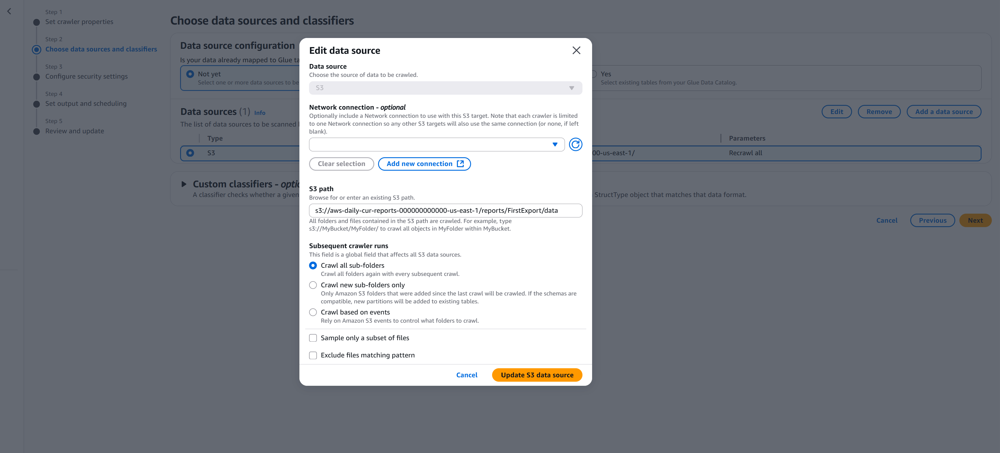
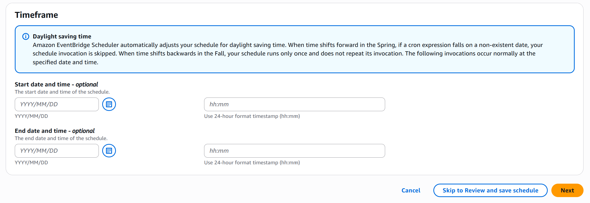

# aws-cost-monitoring-tool
Tool that augments services in the AWS environment to report and detect data regarding cost and usage in AWS in the form of dashboards and alerts.

## Architecture Overview

## Build
### 1. Create S3 Bucket to house Lambda code
First, create a Cloudformation Stack (new resources option) and upload the `lambda_code_bucket.yaml` template file. 

(fix steps below)

Once the Cloudformation Stack is created, compress each of `.py` files in `lambdas-py` folder to a `.zip` format with their respective names (`metric-data-creation.zip` & `automated-dashboard-creation`) and upload it to the bucket that was created by the Stack.

### 2. Remaining Architecture
Second, deploy the `cef_tool_infrastucture3.yaml` template file through another Cloudformation Stack (new resources option).
#### Important Note in regards to YAML default:
- Glue Crawler frequency is set to On Demand.
- EventBridge Scheduler is Disabled.

### 3. Setting up CUR Reports forwarding to S3
In AWS, go to Billing and Cost Management → Data Exports → Create:

#### Once `Create` is pressed, adhere to these settings for the report:
- Export name → Name of your choice
- Data table content settings → CUR 2.0
- (ignore additional export content unless wanted)
- Time granularity → Daily
- Compression type and file format → Parquet - Parquet
- File versioning → Overwrite existing data export file
- S3 Bucket → Select existing bucket → Select the bucket `aws-daily-cur-reports-${AWS::AccountId}-${AWS::Region}` (follows YAML)
- S3 path prefix → Create a location within the S3 bucket to store the export

**After export creation, it may take up to 12-24 hours for the export to populate in the bucket.** But once it appears in the bucket, it will follow a similar structure of `{bucket}/{path-prefix}/{export-name}/data/BILLING_PERIOD={year}-{month}/`.

### 4. Modifying Glue Grawler
Head to AWS Glue → Crawlers (under Data Catalog) → Select the `daily-cur-crawler`

#### Now two things need to be changed:
a. Select edit (top right) → Select edit on step 2 → Select the existing S3 data source → Edit → Change the S3 path to `s3://{existing-bucket}/{path-prefix}/{export-name}/data/`.

b. Then, press Next (2x) → Crawler schedule (change from On demand to Custom) → Set cron expression to `cron(0 0/2 * * ? *)`.

### 5. Modifying EventBridge Scheduler
Go to EventBridge → Schedules → Select `put-metric-schedule` → Edit → Timeframe (at the bottom of the page). Put in a start time & date that will represent when it is going to initiate in the future for your environment.

